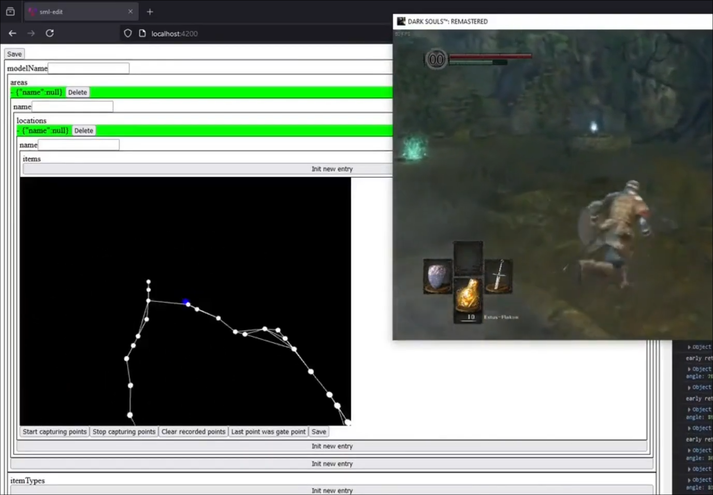
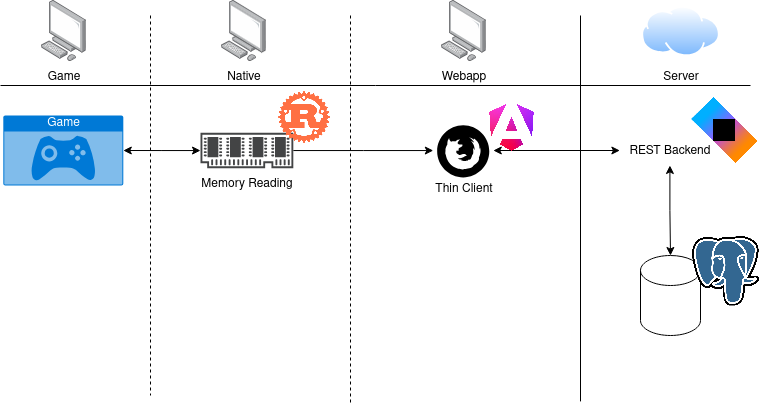
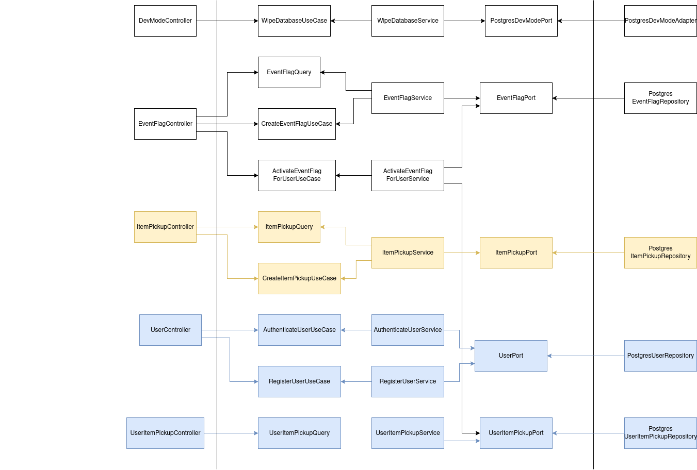
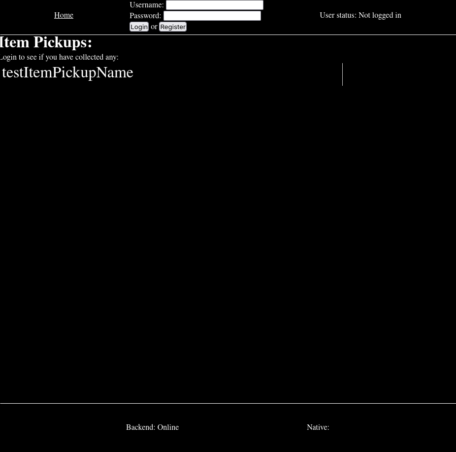
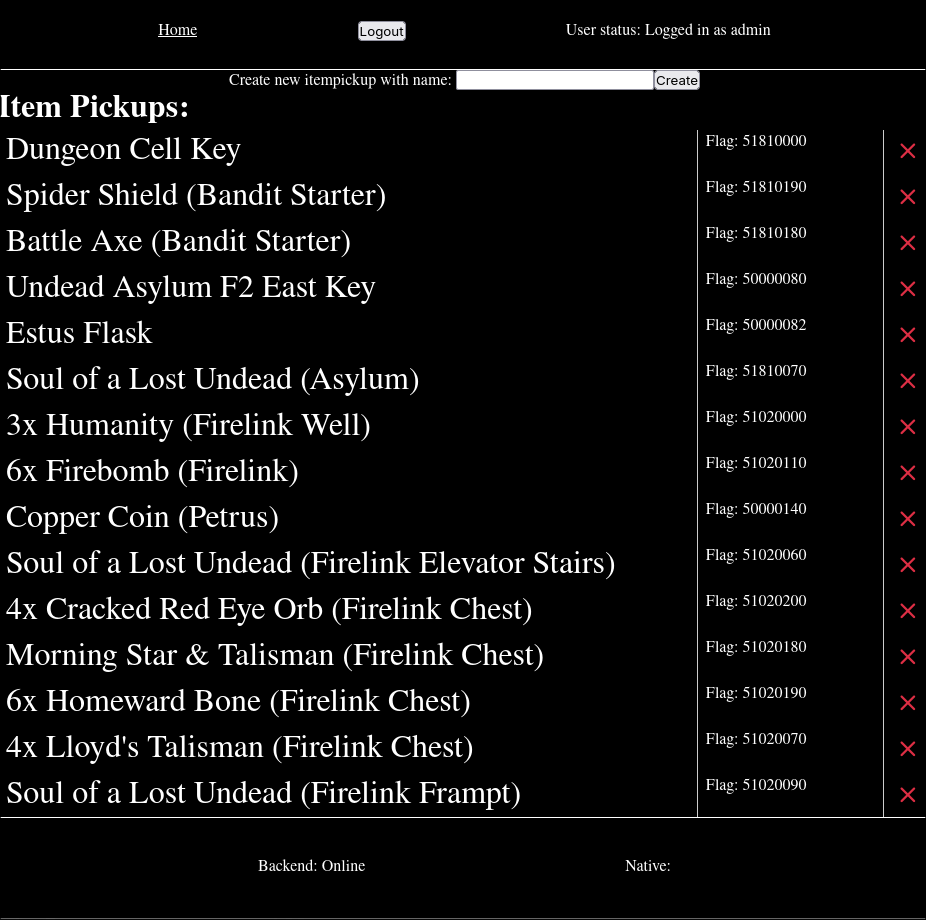

+++
date = '2025-10-06T18:00:00+01:00'
draft = false
title = 'Building an automatic item checklist for Dark Souls'
authors = ["Say"]
+++
## Introduction

Dark Souls: Remastered is my favorite video game.
I am not alone with this.
In fact, as you might know, it is treated as one of, if not the best, video game of all time, winning uncountable awards left and right.
I like it so much that I play it a lot, even doing some challenge runs here and there, like no-death runs.

## Problem

For that, I plan out routes in advance that I will run again and again, tweaking and retrying them until I make it.
This is a similar pattern I've observed with many streamers and players preparing for something like a no-death run.

All of these efforts had two things in common:
1. Planning the routes through Notepad, Excel, or something similar... YUCK!
2. And, in streamers' cases, having their mods auto-check their progress or having to do it manually.

This sucks, and I'm going to do something about it!

## Solution

The goal is a tool that you can open on your second monitor to show you exactly what's next and to track the current status of the run.
You should be able to create, edit, and share routes through it.
This is also what I have been experimenting with for the past months or even years.

It got pretty advanced after a few restarts and a lot of research, but because I was just experimenting, I never did anything properly.
The complexity and burden of faulty abstractions and wrong decisions led to the codebase becoming very unmaintainable, and the iteration speed suffered heavily.

That's when I sat down a few weeks ago and thought to myself: I have been experimenting on this for way too long without having anything to show for it.
It's time to lock in and deliver software!

## Scoping

So, if I learned one thing in the last attempts, it's that you can't start by attacking the final goal immediately.
The first MVP is going to be something way simpler than just described: To get into development and have something to test, use, and release ASAP.
This MVP will be an automatic item checklist for now. No routing, just checking off items from a list.

## High level

This is going to be implemented by dividing our software into three parts.

1. The first part runs natively on the user's machine. It's going to hook into the game's memory and read the event flags the game uses to communicate the status of item pickups.
2. These flags then get sent to the second part, a web app, via a WebSocket. The web app is primarily concerned with user login, communication, and displaying information.
It first forwards the event flags to the backend, which is the third part of the app.
3. The backend then validates the user and stores the collection data into a database.

The frontend then updates its list for the current user and checks off all newly collected items.

## Implementation

The native binary is Rust, the web app is Angular, and the backend is Ktor.
I handle CI/CD with GitHub Actions (where I definitely need to host my own runners after this, as I ran out of storage halfway through the first month and had to switch to deploying manually).
I host the app using my own GitOps tool (check out that post if you haven't seen it yet).

### Native part
The native part is inspired by several existing tools, like [Soulsplitter](https://github.com/FrankvdStam/SoulSplitter) or [Kahmul's 100% tracker](https://github.com/Kahmul/Dark-Souls-100-Percent-Tracker. 
It finds the address of the desired event flag and reads it as an integer into a Vec before sending it onto a [Tungstenite WebSocket](https://github.com/snapview/tungstenite-rs).

I initially intended for the native part to hook into the game with a DLL injection to use a push-based event flag reading approach instead of polling,
but Windows Defender really did not like that.
So, I went with the polling approach, which has slightly worse performance but is still quite quick and much easier to maintain and develop.

### Web app
The Angular part is pretty dumb—the very definition of a thin client—so I'm going to skip it in this section.

### Backend
The backend is pretty neat. I used [Hexagonal Architecture](https://en.wikipedia.org/wiki/Hexagonal_architecture_(software)) to divide it into several use cases, which makes it very navigable.
I also tried to use [TDD](https://en.wikipedia.org/wiki/Test-driven_development) for the most part, although I'll have to re-add some tests in the next iteration.
I decided to use raw JDBC instead of something like JPA, since ORMs don't work well with my architectural style (and my hate for JPA is a topic for another time).

In the architecture diagram, you can clearly see the different use cases in the backend and the data flow associated with them,
like all the stuff related to users or all the stuff related to item pickups.

## Editorial

Damn, this already looks great, but... Feels a little empty, doesn't it?
Right, now that the tool itself works, we'll have to populate it with concrete data.

For that, I played through the entire game, writing down every item and its event flag, and then added all the information into the tool.
It was honestly pretty refreshing to get a change from editing and coding to just play Dark Souls for a few days in peace,
so I'm looking forward to doing more like that in the future.

## Conclusion

And with that, the tool works for what it was supposed to do!

The native tool might still trigger a warning that I'm not a trusted developer (because I'm broke), but at least Windows no longer thinks it's a virus, so... yay, I guess?

Apart from that, you can use the app at slr.say.software. There is also [a bug tracker available](https://github.com/soulslike-routing/bugtracker/) where you can report any issues you find.

Now that we have a basic MVP running, it's time to extend the feature set. But before I tackle that, I first have to take care of some infra and housekeeping.
Self-hosted action runners are a top priority, and apart from that,
I've collected about 20 small tickets that need solving to guarantee a maintainable and clean codebase—which I definitely need to keep my sanity.

After that, we will probably hack away at implementing actual routing! 