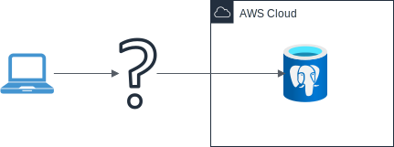
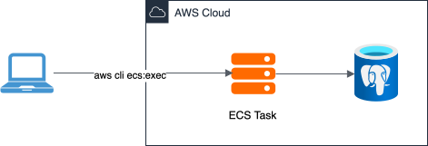

+++
date = '2025-10-23T13:38:18+02:00'
draft = false
title = 'ECS Jumphost'
description = "Create a secure ECS-based jumphost using ecs exec and SSM port forwarding to access services (like Postgres) inside a private VPC."
[params]
authors = ["flam"]
+++

## The Problem

If you've ever found yourself in the position of wanting to connect to a service running inside your private VPC in AWS you've probably wondered how and had fun trying to find out how tf you can do this in a simple and secure way.

<!--more-->


I've encountered the following problem; I wanted to connect to a postgres database running inside a private VPC:



A few options came to mind;
- Make the database publicly accessible
- Heard from another team that they use a Codebuild job with SSH port forwarding
- Run SSH port forwarding through an EC2 instance instead
- Search for a different solution

## The Problems

Lets go through the options; Making the database / service publically accessible is a _suboptimal_ solution and often times not feasable, so that one's out.

[Using a Codebuild Debug job](https://docs.aws.amazon.com/codebuild/latest/userguide/sandbox-ssh-tutorial.html) and SSH-ing through that?
Works... but feels hacky and has other downsides, like cost and max. runtime of 1 hour...

Next, SSH port forwarding through an EC2 instance might come to mind. 
Simply allow the instance to connect to your database / service and then use it as jumphost / forwarding proxy.
This feels much nicer, right?
Problem is, in my project I wasn't able to use EC2 for other reasons.

## The Solution
The solution I ended up with is pretty neat imo.
I've found the option of using the aws CLI's [ecs execute-command](https://docs.aws.amazon.com/AmazonECS/latest/developerguide/ecs-exec-run.html) for getting a shell session running inside an ECS Task.
Note that installing the [(official) aws cli session manager plugin](https://docs.aws.amazon.com/systems-manager/latest/userguide/session-manager-working-with-install-plugin.html) is required.
With `ecs exec` you can run any command, so something like `/bin/bash` works too; the command looks something like this:
```bash
aws ecs execute-command \
    --profile $AWS_PROFILE \
    --region $REGION \
    --cluster $CLUSTER_NAME \
    --task $TASK_ID \
    --container $CONTAINER_NAME \
    --interactive --command "/bin/bash"
```

With the corresponding Dockerfile (including some utilities):
```Dockerfile
FROM --platform=linux/arm64 public.ecr.aws/amazonlinux/amazonlinux:latest

RUN dnf install -y \
    unzip \
    jq \
    postgresql17 \
    zstd \
    zip \
    zsh \
    && dnf clean all \
    && rm -rf /var/cache/dnf

CMD ["sleep", "infinity"]
```

_Note: I'm not gonna talk about actually creating the ECS Task in detail. In short though; I pushed the image to ECR and created a cluster for the task. I also configured the tasks security group to allow it to connect to the postgres DB through the VPC._


After creating a docker image I was able to run the command to get a shell running inside the ECS task:

```
Starting session with SessionId: ecs-execute-command-vvs9i5lb3l2rv5nnu5dg2rtk44
bash-5.2# psql -h the-postgres-db.random_chars.region.rds.amazonaws.com -U db_superuser
Password for user db_superuser:
psql (17.6, server 17.4)
SSL connection (protocol: TLSv1.3, cipher: TLS_AES_256_GCM_SHA384, compression: off, ALPN: postgresql)
Type "help" for help.

database=>
```

Yippie!! We've got a shell with which we can access the postgres db :3

Now our process looks like this:



This is neat, but still a bit lacking.
We can talk to the database / service and all, but it's all via CLI, it would be so much more convenient if we could connect for example via Datagrip for development / experimentation.

I then came across the [AWS System Manager](https://docs.aws.amazon.com/systems-manager/latest/userguide/what-is-systems-manager.html).
It does a lot of things, but most importantly it has a feature to forward a port via the `start-session` subcommand.
First intended for EC2, it's now also usable with ECS Tasks, one just has to format the commands target a bit differently.
With EC2 you can simply provide an instance id as target, with ECS it's a bit more complicated.
From [the docs](https://docs.aws.amazon.com/systems-manager/latest/userguide/session-manager-working-with-sessions-start.html#sessions-remote-port-forwarding) you can already see the required command is a bit funnier:
```bash
aws ssm start-session \
    --target ecs:<ECS_cluster_name>_<ECS_container_ID>_<container_runtime_ID> \
    --document-name AWS-StartPortForwardingSessionToRemoteHost \
    --parameters '{"host":["URL"],"portNumber":["port_number"], "localPortNumber":["port_number"]}'
```

Getting all of the required info by hand was a bit annoying, and I am lazy, so I immediately wrote a shell script that fetches the required info with the AWS CLI to quickly connect to my postgres instance:

```bash
#!/bin/bash
set -eou pipefail

CLUSTER="ecs-jump"
SERVICE_NAME="jumphost"
RDS_IDENTIFIER='the-postgres-db'
RDS_PORT="5432"

TASK_ARN=$(aws ecs list-tasks \
    --cluster $CLUSTER \
    --service-name $SERVICE_NAME \
    --query 'taskArns[0]' \
    --output text
) # We only have a single task in the jumphost cluster

if [ -z "$TASK_ARN" ] || [ "$TASK_ARN" == "None" ]; then
    echo "No task found in cluster $CLUSTER. Ensure task is running."
    exit 1
fi

echo "Task ARN: $TASK_ARN"

# Task ID is the last segment of the ARN (part after the last '/')
TASK_ID=$(basename "$TASK_ARN")
echo "Task ID: $TASK_ID"

RUNTIME_ID=$(aws ecs describe-tasks \
    --cluster $CLUSTER \
    --task $TASK_ARN \
    --output json \
    | jq -r '.tasks[].containers[].runtimeId'
)

echo "Runtime ID: $RUNTIME_ID"

RDS_HOST=$(aws rds describe-db-instances \
  --db-instance-identifier "$RDS_IDENTIFIER" \
  --query 'DBInstances[0].Endpoint.Address' \
  --output text
)

echo "RDS Host: $RDS_HOST"

TARGET="ecs:${CLUSTER}_${TASK_ID}_${RUNTIME_ID}"
echo "Target: $TARGET"

echo "Forwarding $RDS_HOST Port $RDS_PORT to localhost:$RDS_PORT..."

aws ssm start-session \
  --target "$TARGET" \
  --document-name AWS-StartPortForwardingSessionToRemoteHost \
  --parameters '{"host":["'"$RDS_HOST"'"],"portNumber":["'"$RDS_PORT"'"],"localPortNumber":["'"$RDS_PORT"'"]}'
```

After running the script:
```
❯ ./forward.sh
Task ARN: arn:aws:ecs:region:account_id:task/ecs-jump/583b4ed1cea341baa35d49e97f117feb
Task ID: 583b4ed1cea341baa35d49e97f117feb
Runtime ID: 583b4ed1cea341baa35d49e97f117feb-1148496887
RDS Host: the-postgres-db.random_chars.region.rds.amazonaws.com
Target: ecs:ecs-jump_583b4ed1cea341baa35d49e97f117feb_583b4ed1cea341baa35d49e97f117feb-1148496887
Forwarding the-postgres-db.random_chars.region.rds.amazonaws.com Port 5432 to localhost:5432...

Starting session with SessionId: account-name-9frlo86p43y5f69pejteif5pzu
Port 5432 opened for sessionId account-name-9frlo86p43y5f69pejteif5pzu.
Waiting for connections...
```

In another local shell window:
```
❯ psql -h localhost -p 5432 -U db_superuser
Password for user db_superuser:
psql (18.0, server 17.4)
SSL connection (protocol: TLSv1.3, cipher: TLS_AES_256_GCM_SHA384, compression: off, ALPN: postgresql)
Type "help" for help.

database=>
```

Forwarding to a local port now works without awkward workarounds and half-baked solutions :D

This of course works with any service inside the VPC that can be reached by the jumphost task, not just RDS/Postgres.
